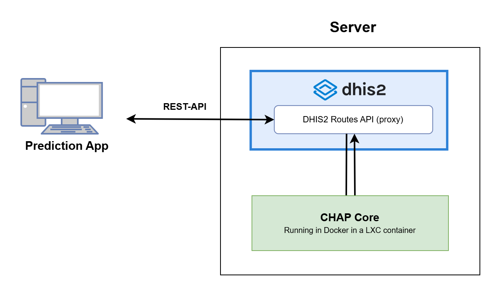

# Deploy CHAP
**This repository is an example of how CHAP Core infrastructure and code could be deployed to a server running Docker inside a LXC/LXD container.**

This repository uses a GitHub Action to deploy CHAP Core to a server. The process consists of two steps. First, it deletes the instance by rebuilding it. Next, it deploys CHAP Core to an LXC container. This repository assumes you are running DHIS2 on the same server.

To be able to run CHAP Core correctly, it requires you to have access to Google Earth Engine credentials and provide these to CHAP Core. You can read more about DHIS2 and Google Earth Engine [here](https://docs.dhis2.org/en/topics/tutorials/google-earth-engine-sign-up.html)
 
General CHAP documentation could be fond at: [https://dhis2-chap.github.io/chap-core/](https://dhis2-chap.github.io/chap-core/)
Server documentation could be found at: [https://dhis2-chap.github.io/chap-core/server/running-chap-on-server.html](https://dhis2-chap.github.io/chap-core/server/running-chap-on-server.html)

### Central files in this repository:
- [GitHub action](.github/workflows/deploy_nrec.yml)
- [Deployment](./init.sh)

### Overview of CHAP architecture:

